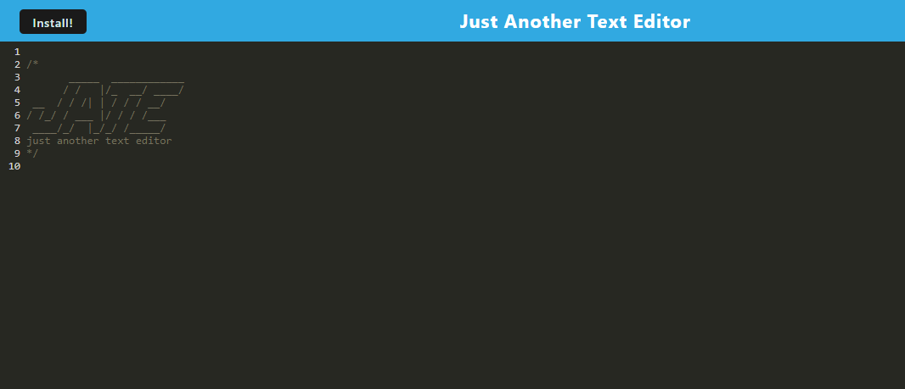

# PWA Text Editor (J.A.T.E.)

## License

This application uses an MIT license.

## Description

Just Another Text Editor (J.A.T.E.) is a Progressive Web Application that allows a user to use a JavaScript text editor within a browser and have their data save whether online or not.

## Table of Contents

* [Installation](#installation)
* [Usage](#usage)
* [License](#license)

## Installation Instructions

Once the repo has been cloned to your personal machine, run npm i in your machine's CLI from  to install the required Node.js packages. Next, run npm run build to unpack the bundled files into a distribution package within the application's directory. Finally, run the command npm run start:dev in your CLI and open the application on port 6505 in your browser. 

## Usage

The application is a modest text editor that stores inputs from the user for access at their convenience. Simply provide text in the application's main window.

## Tests

None for this application.

## Questions

None for now.

## App Author

chocochip287 - [GitHub](https://github.com/chocochip287)

## Author's Email

chocochip287@gmail.com